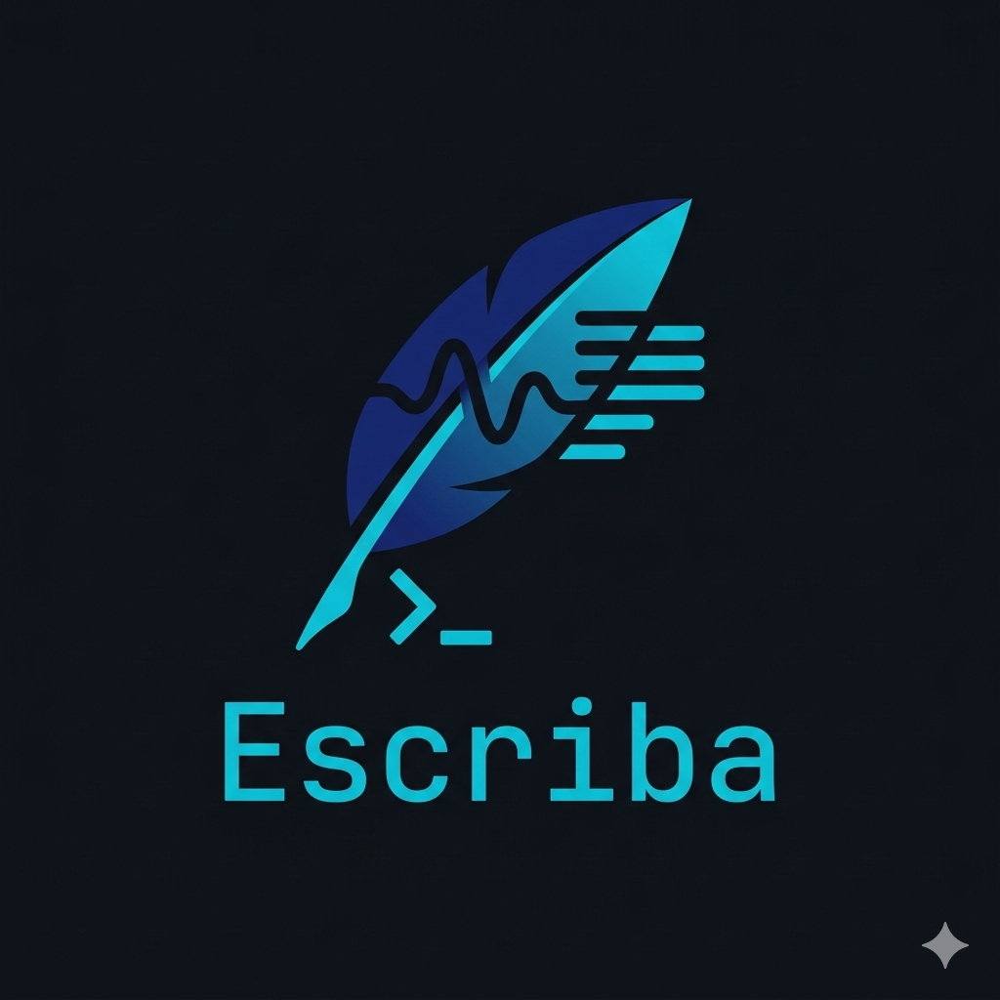

<p align="center">
  
</p>

# Escriba

Script **Python** de alta resiliência para baixar legendas (automáticas ou manuais) e metadados de todos os vídeos de um canal do YouTube de forma sequencial e controlada.
Caso um vídeo não possua legenda, o script pode fazer o download do **áudio de fallback** ou simplesmente registrá-lo para ser ignorado em buscas futuras, otimizando o tempo.

> O script original `baixar-canal` foi reescrito e rebatizado como **Escriba** (`escriba.py`). Esta nova versão utiliza um motor JSON assíncrono para mapeamento de estado, abandona o tráfego bloqueante de I/O em arquivos de texto antigos, e introduz auto-cura (auto-healing) para cookies corrompidos do Chrome.

> O Escriba é uma ferramenta poderosa para quem deseja criar uma base de conhecimento local e estruturada a partir de canais do YouTube, seja para estudo, pesquisa ou consumo offline.

> Fiz pensando em estudantes e entusiastas, como eu, que desejam criar uma base de conhecimento local e estruturada a partir de canais do YouTube.

> Futuras implementações:

- **Integração com NotebookLM** — Gera arquivos de consolidação para upload no [NotebookLM.google.com](https://notebooklm.google.com) .

---

## Funcionalidades Principais

- **Mapeamento JSON Assíncrono** — Na primeira execução, o script descobre todos os IDs do canal via `--flat-playlist` e usa um pool de threads múltiplas para extrair datas paralelamente, salvando o estado em um arquivo `escriba_[canal].json`.
- **Download Deliberado em Massa** — Processa os canais apenas focando nos vídeos não baixados (cross-checking o JSON de tracking na memória).
- **Auto-cura de Autenticação (Cookies)** — Se o Chrome exportar diretivas de cookies inválidas ou corrompidas que crasham o `yt-dlp`, o Escriba deleta secretamente o cache quebrado e extrai novos cookies on-the-fly sem interromper o processo.
- **Detecção de Idioma Estrita** — Auto-detecta o idioma nativo de um canal. Lida inteligentemente com canais que usam `/videos` ou URLs puras para não falhar na extração global.
- **Injeção de JS Runtime** — Propaga globalmente caminhos de Node.js via `NODE_PATH` para quebrar as proteções baseadas em Javascript de listas do YouTube moderno.
- **Limpeza Profunda de Legendas** — Deduplica roll-ups do YouTube, remove formatação XML/HTML e limpa o texto (`--txt`) sem timestamps nativamente.
- **Fallback de Áudio (Opcional)** — Se configurado via flag, vídeos sem legenda disparam o download automático de seu respectivo áudio para a pasta de fallback `audios/`.

---

## Pré-requisitos

| Dependência | Descrição |
|---|---|
| **Python 3.10+** | Runtime de execução central |
| **yt-dlp** | Mecanismo subjacente de download de streams (instalado pelo venv) |
| **Node.js** | JS runtime obrigatório para desencriptar requisições do YouTube atual |
| **Chrome** | Extração passiva de autenticação base (necessário logado no YT) |

---

## Instalação e Ambiente

O Escriba pode ser rodado nativamente em qualquer sistema, desde que os pré-requisitos estejam presentes.

### MacOS / Linux

```bash
# 1. Entre no diretório e crie o ambiente virtual
cd escriba
python3 -m venv .venv
.venv/bin/pip install yt-dlp python-dotenv

# 2. (Opcional) Crie o alias no ~/.zshrc ou ~/.bashrc para rodar em qualquer pasta
echo 'alias escriba="/caminho/para/escriba/.venv/bin/python3 /caminho/para/escriba/escriba.py"' >> ~/.zshrc
source ~/.zshrc
```

### Windows

```powershell
# 1. Entre no diretório do projeto via Prompt de Comando ou PowerShell
cd escriba

# 2. Crie o ambiente virtual de Python e ative
python -m venv .venv
.venv\Scripts\activate

# 3. Instale os packages obrigatórios
pip install yt-dlp python-dotenv

# 4. (Opcional) Crie o alias no PowerShell para chamar de qualquer pasta.
# Abra o seu perfil do PowerShell editando-o (comando: `notepad $PROFILE`). 
# (Se o arquivo não existir, crie-o antes). Adicione a linha abaixo:
function escriba { & "C:\caminho\para\escriba\.venv\Scripts\python.exe" "C:\caminho\para\escriba\escriba.py" $args }

# Note: certifique-se de que a política de execução está garantida rodando PowerShell como Administrador: 
# Set-ExecutionPolicy RemoteSigned
```

---

## Uso

Vá para a pasta desejada (onde deseja armazenar as legendas/JSON) e invoque o script:

```bash
# Executando via interpretador explícito:
python /caminho/para/escriba/escriba.py [OPÇÕES] <ID_DO_CANAL_OU_URL>

# Ou, rodando através do alias configurado:
escriba [OPÇÕES] <ID_DO_CANAL_OU_URL>
```

### Exemplos de Uso

```bash
# Comportamento Padrão: mapear canal, descobrir língua, processar incrementalmente e gerar Cluster MD
escriba @FilipeDeschamps

# Forçar idioma (evita a fase de heurística no vídeo mais recente)
escriba -l pt @FilipeDeschamps

# Processar apenas o texto limpo sem timestamps do SRT (Gera um .txt legível)
escriba --txt @FilipeDeschamps

# Desativar a extração em .md (que vem ativa por padrão)
escriba --no-md @FilipeDeschamps

# Baixar somente vídeos publicados estritamente APÓS a data informada
escriba -d 20260101 @FilipeDeschamps

# Forçar purga imediata do cache de Cookies + Modo Turbo (sem sleep entre requests)
escriba -rc -f @FilipeDeschamps
```

### Flags Referenciadas

| Opção | Ação |
|---|---|
| `-l, --lang` | Determina o idioma das legendas (`pt`, `en`, …). Padrão: Automático. |
| `-t, --txt` | Exporta a legenda extraída diretamente para um `.txt` limpo. O `.srt` é apagado. |
| `-m, --md` | Exportação de legendas em `.md` segmentado por IA (Padrão: Ativo). |
| `--no-md` | Desativa a exportação automática em `.md`. |
| `--keep-srt` | Preserva o original em `.srt` no disco ao rodar conversões de formato. |
| `--audio-fallback`| Ao invés de apenas marcar vídeos com erro 404 de legendas, baixa o Áudio (`ba`). |
| `-a, --audio-only`| Pula a aba de subs completamete e baixa *exclusivamente* o áudio bruto de cada item. |
| `-d, --date` | Filtra o dataset. Formato rigoroso: `YYYYMMDD` |
| `-rc, --refresh` | Força renovação destrutiva do arquivo `cookies.txt` base. |
| `--ignore-metadata`| Pula a auto-recuperação de datas e títulos ausentes no histórico JSON. |
| `-f, --fast` | Ignora o resfriamento de Anti-Spam padrão (delay de instantes entre requisições). |
| `-v, --version` | Exibe a versão atual do Escriba. |

---

## Estrutura de Arquivos de Rastreio (State Cache)

O Escriba mudou a arquitetura legada.

| Arquivo Tracker | Significado |
|---|---|
| `escriba_[canal].json` | O Banco de Dados Atômico Primário. Ao invés do `historico.txt` velho lógico de checagem I/O linear, o JSON mantém um cache vivo centralizado de tudo: `video_id`, `subtitle_downloaded`, `title`, `duration_s`, `view_count`, `publish_date`, a flag `has_no_subtitle` de +30 dias, etc. |
| `historico.txt.bak` | Gerados pela função de **Auto-Migração**. Se rodar o ecosistema "Escriba" em uma pasta velha do projeto "Baixar Canal", o Escriba consolida o texto em JSON e renomeia os remanescentes textuais em segundos. |
| `<pasta>-<id>.info.json`| Metadata integral por ID de video extraída temporariamente e **deletada automaticamente** após o dado ser consolidado no `escriba_[canal].json`. |

## Troubleshooting

- **Travamentos em Fase 1 ("Nenhum vídeo retornado")**: Em atualizações severas do Google contra raspadores, abra o seu terminal e execute: `/Users/jandirp/scripts/escriba/.venv/bin/python3 -m pip install -U yt-dlp` para puxar os patches open-source mais modernos da comunidade e reiniciar o seu ambiente invencível.

---

## Portfólio — Ciência de Dados & NLP

> **Nota técnica:** Esta seção descreve os componentes de Machine Learning, NLP e Engenharia de Dados implementados no Escriba, voltada para avaliação como peça de portfólio.

### Problema

Canais do YouTube geram centenas de horas de conteúdo em formato desestruturado (legendas automáticas com roll-ups, timestamps e ruído HTML). Transformar esse volume bruto em documentos **estruturados, navegáveis e semanticamente segmentados** exige um pipeline robusto de processamento de linguagem natural — e é exatamente o que o Escriba resolve.

### Pipeline de NLP & Machine Learning

O motor central de conversão `.srt → .md` (`srt_to_md`) implementa um pipeline de 6 fases:

```
┌──────────────────────────────────────────────────────────────────┐
│  SRT Bruto                                                       │
│  (legendas automáticas com roll-ups, HTML, duplicatas)           │
└───────────────┬──────────────────────────────────────────────────┘
                ▼
┌───────────────────────────────────────────────────────────────┐
│  Fase 1 · Janelas Adaptativas                                 │
│  Agrupa legendas em janelas temporais calibradas pela duração  │
│  total do vídeo: 30s (<30min) | 60s (30–60min) | 90s (>60min) │
└───────────────┬───────────────────────────────────────────────┘
                ▼
┌───────────────────────────────────────────────────────────────┐
│  Fase 2 · Topic Detection via TF-IDF + Cosine Similarity      │
│  Vetoriza cada janela com TfidfVectorizer (sklearn), calcula   │
│  similaridade cosseno entre janelas adjacentes e detecta       │
│  quebras de tópico nos vales de similaridade (threshold        │
│  adaptativo por duração: 0.25 / 0.35 / 0.50)                  │
└───────────────┬───────────────────────────────────────────────┘
                ▼
┌───────────────────────────────────────────────────────────────┐
│  Fase 3 · Segmentação Semântica com Densidade Mínima          │
│  Garante N segmentos mínimos (3→10) via forced breaks nos     │
│  pontos de menor similaridade, evitando documentos monolíticos │
└───────────────┬───────────────────────────────────────────────┘
                ▼
┌───────────────────────────────────────────────────────────────┐
│  Fase 4–6 · Geração de Markdown Estruturado                   │
│  Metadados → TOC com keywords TF-IDF → Transcrição            │
│  paragrafada com âncoras de tempo e deduplicação de roll-ups   │
└───────────────────────────────────────────────────────────────┘
```

### Técnicas Aplicadas

| Área | Implementação |
|---|---|
| **Feature Extraction** | `TfidfVectorizer` (scikit-learn) com remoção de stopwords (NLTK + marcadores orais customizados para PT, EN e ES) |
| **Similaridade Semântica** | `cosine_similarity` entre vetores TF-IDF de janelas adjacentes para Topic Boundary Detection |
| **Keyword Extraction** | Top-N termos por segmento via score TF-IDF agregado, usado como label semântico automático |
| **Text Preprocessing** | Deduplicação de roll-ups via longest-common-prefix com overlap ratio; remoção de tags HTML/XML; normalização de whitespace |
| **Adaptive Thresholding** | Parâmetros de segmentação (window size, TF-IDF threshold, min segments) calibrados dinamicamente pela duração do conteúdo |
| **Stopwords Híbridas** | Fusão de corpus NLTK com dicionários proprietários de marcadores de discurso oral — captura "muletas" como *"né"*, *"tipo"*, *"basically"*, *"bueno"* que o NLTK ignora |

### Engenharia de Dados

| Componente | Detalhe |
|---|---|
| **State Machine JSON** | Banco de dados atômico por canal (`escriba_*.json`) com escrita via temp-file + rename (crash-safe). Migração automática de schemas legados on-the-fly. |
| **Paralelismo** | `ThreadPoolExecutor` com pool de até 40 workers para extração concorrente de metadados (datas) durante o mapeamento inicial do canal |
| **Processamento Incremental** | Cross-checking em memória do state JSON — processa apenas deltas (vídeos novos), sem reprocessar o dataset inteiro |
| **Auto-cura de Autenticação** | Detecção e regeneração silenciosa de cookies corrompidos do Chrome durante o pipeline, sem interrupção do fluxo |
| **Lazy Loading de Dependências** | Imports de ML (`sklearn`, `pysrt`, `numpy`, `nltk`) são carregados apenas quando `-m`/`--md` é ativado, mantendo o boot do CLI < 200ms para operações simples |

### Stack Técnica

```
Python 3.10+ · scikit-learn · NLTK · NumPy · pysrt · yt-dlp
ThreadPoolExecutor · JSON State · Regex · Subprocess
```

---

## Licença

MIT
