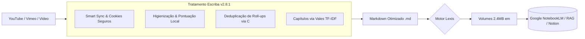

<p align="center">
  
</p>

<p align="center">
  
  
  
  
  
  
</p>

# Escriba: Video-to-Knowledge ETL Pipeline
### O Orquestrador de Inteligência para YouTube, Vimeo e Ingestão em RAG / NotebookLM

**Escriba** é um pipeline de extração, tratamento sintático-semântico e estruturação de dados não estruturados de vídeo para bases de conhecimento (**Google NotebookLM**, bancos vetoriais RAG e **Notion**).

Diferente de simples baixadores de legenda, o **Escriba v2.8.1** atua como um **Escriba Digital de Nível Editorial**: ele higieniza o texto bruto de voz (ASR), restaura a pontuação gramatical e maiúsculas localmente, deduplica *roll-ups* e segmenta os temas em capítulos lógicos, entregando documentos Markdown de altíssima fidelidade com máxima eficiência computacional.

O output final é uma base de conhecimento hiper-estruturada, pronta para:
* Alimentar assistentes de IA generativa (como o **Google NotebookLM**) sem alucinações por falta de pontuação ou vazamento de contexto.
* Integrar arquiteturas **RAG (Retrieval-Augmented Generation)** locais ou em nuvem com alta revocação (*recall*).
* Reduzir em mais de 98% o tempo gasto com curadoria manual de vídeos.

---

## 💎 Por que a Qualidade de Texto do Escriba faz Diferença para o NotebookLM?

Legendas automáticas do YouTube vêm como um "fluxo contínuo sem pontos, vírgulas ou maiúsculas", poluído por notas musicais (`♪`) e ruídos de áudio (`[Música]`). Enviar esse texto bruto para o NotebookLM faz com que a IA misture conceitos, corte citações ao meio e perca precisão.

O **Escriba** resolve esse problema através de um tratamento multicamadas:

```
[Legenda Bruta ASR] ➔ [1. Limpeza de Artefatos & Roll-ups] ➔ [2. Pontuação Acústica & Sintática] ➔ [3. Segmentação Semântica TF-IDF] ➔ [4. Encapsulamento <article> & Lexis] ➔ [Google NotebookLM]
```

### 🏆 Pilares de Qualidade no Tratamento do Texto

1. **✍️ Restauração Local de Pontuação & Maiúsculas**:
   - Analisa o tempo exato das pausas de fala do orador no SRT:
     - Pausas $\ge 0.4\text{s}$ ou fim de parágrafo $\rightarrow$ Inserção de **Ponto Final (`.`)** e **Maiúscula** na frase seguinte.
     - Pausas médias ($0.15\text{s}$ a $0.39\text{s}$) $\rightarrow$ Inserção de **Vírgula (`,`)**.
     - Frases com gatilhos interrogativos (*"por que"*, *"como"*, *"onde"*, *"será que"*) $\rightarrow$ Fechamento com **Ponto de Interrogação (`?`)**.
   - **100% Local**: Funciona na máquina sem depender de chamadas pagas a LLMs remotos ou latência de rede.

2. **📌 Garantia de Divisão por Capítulos (`##` e `###`) e Vídeos Longos**:
   - Detecta os vales de similaridade de cosseno (TF-IDF) no vocabulário do orador.
   - **Safety Net para vídeos longos ($\ge 15\text{ min}$, $\ge 30\text{ min}$, $1\text{h}+$):** assegura divisão adaptativa (3 a 8 capítulos) e quebras periódicas de parágrafos a cada 1-2 minutos, mesmo que o vocabulário do orador seja linear.
   - Suporte nativo a legendas automáticas com sufixo `-orig` (ex: `.en-orig.srt`), mantendo a detecção correta de idioma e vocabulário de *stopwords*.
   - Garante que todo vídeo possua uma estrutura hierárquica clara (`# Título` $\rightarrow$ `## Sumário` $\rightarrow$ `## Transcrição por Capítulos` $\rightarrow$ `### [timestamp] Tópico`).

3. **📦 Consolidação de Volumes para NotebookLM (Motor Lexis)**:
   - Respeita o limite ideal de **2.4MB por volume (~500k tokens)** otimizado para a janela de contexto do Google NotebookLM.
   - Encapsula cada vídeo em escopos isolados `<article class="video-entry">` com **Frontmatter YAML** (`title`, `video_id`, `url`, `date`, `file_source`).
   - Gera uma **Tabela de Índice (Volume Index)** cronológica no rodapé do arquivo para navegação instantânea.

4. **🧹 Higienização de Ruídos e Termos Específicos (`rules.txt`)**:
   - Remove automaticamente notas musicais (`♪`), ruídos de ASR (`[Música]`, `[Aplausos]`, `[Vinheta]`) e vícios de fala (*"né"*, *"tipo"*, *"sabe"*).
   - Aplica substituições terminológicas customizadas (ex: *Ekklezia*, *Sete Montes*, *Shabbat*).

---

## ⚡ Novidades & Funcionalidades da Versão 2.8.1

* **⚡ Smart Sync com Parada Antecipada (*Early Stopping*)**: Ao verificar canais conhecidos, o Escriba interrompe a paginação assim que encontra os vídeos já indexados no banco local, reduzindo chamadas ao YouTube de minutos para segundos (use `--full-scan` para reavaliar o canal por completo).
* **🎬 Download Direto de Vídeo Full HD (`-dv` / `--download-video`)**: Baixa o vídeo original em Full HD (1080p, sem áudio) para vídeos individuais e playlists.
* **🌐 Sincronização Multi-Canal Automática**: Se múltiplos canais pertencem ao mesmo repositório no arquivo `escriba_[canal].json`, o Escriba detecta e sincroniza todos consecutivamente em lote.
* **📊 Diagnóstico de Status Global (`--status`)**: Retorna em JSON o raio-X completo de todos os bancos locais (total de vídeos, baixados, sem legenda e pendentes).
* **🍪 Gestão Avançada de Cookies & Multi-Navegador**: Suporte nativo a 7 navegadores (`-b / --browser`), warm-up com timeout resiliente, destruição de rastreadores e permissões restritas de arquivo (`chmod 0o600`).
* **🧵 Suporte a Free-Threaded Python 3.14 (PEP 703)**: Detecção automática da desativação do GIL (`Py_GIL_DISABLED`) para escalar paralelismo massivo em processamento de texto e TF-IDF.
* **🪟 Scripts Utilitários Nativos**: Inclusão de `juntar.ps1` (PowerShell) e `juntar.bat` (CMD) para consolidação instantânea com duplo clique ou comando simples.

---

## ⚡ Performance & Otimizações de Baixo Nível (Bolt Engine)

As versões mais recentes do Escriba incorporam otimizações de baixo nível (*Bolt Engine*) com foco em processamento veloz de grandes volumes de legendas e diretórios massivos:

* **⚡ Otimização de Cache de Disco (`_check_disk_files`)**:
  - Categorização unificada de arquivos `.srt` e `.md` em uma única passagem de loop com concatenação otimizada de paths, reduzindo I/O em pastas com milhares de vídeos.
* **⚡ Iteração Nativa em C com Tuplas (`startswith`)**:
  - A checagem de prefixos de perguntas no motor gramatical (`rules.py`) utiliza tuplas nativas com `str.startswith((...))`, substituindo geradores Python com `any()`.
* **📂 Varredura Rápida de Diretórios (`os.scandir`)**:
  - Substituição de `os.listdir()` + `stat()` pelo iterador `os.scandir()` em `lexis.py` e utilitários de busca, consultando diretamente a tabela de diretórios do SO.
* **⚡ Deduplicação de Linhas em C (`zip()`)**:
  - No algoritmo de remoção de *roll-ups* de legendas (`_dedup_lines`), comparações de sequências utilizam `zip()`, eliminando loops manuais indexados e acelerando o processamento.
* **🚀 Pré-Compilação Global de Expressões Regulares**:
  - Todas as expressões regulares de higienização e pontuação são pré-compiladas no escopo global dos módulos (`re.compile`), eliminando compilações repetidas a cada frase analisada.
* **🛡️ Padrão EAFP para Filesystem**:
  - Eliminação de verificações duplas no disco (padrão `if exists() -> stat()`). Adoção de blocos estruturados `try...except OSError` diretos sobre `stat()`.

---

## ⏳ Economia de Tempo & ROI (Retorno sobre Investimento)

Mapear e catalogar conteúdo de vídeo manualmente é um gargalo operacional. O Escriba automatiza mais de 98% desse processo:

| Etapa do Processo | Tempo Manual Estimado | Tempo com Escriba | Descrição da Automação |
| :--- | :--- | :--- | :--- |
| **1. Extração/Download** | 10 a 15 min | **< 30 seg** | Download em lote de metadados e legendas de canais usando `yt-dlp`. |
| **2. Higienização & Pontuação** | 60 a 120 min | **Instantâneo** | Remoção de ruídos ASR (`♪`), restauração de `.`, `,`, `?` e maiúsculas via pausas acústicas. |
| **3. Quebra Semântica (Capítulos)**| 30 a 45 min | **< 10 seg** | Análise matemática do texto (TF-IDF + Vales de Cosseno) para garantir capítulos H2/H3. |
| **4. Estruturação Markdown** | 15 min | **Instantâneo** | Geração de metadados YAML, timestamps `[HH:MM:SS]` e encadeamento hierárquico. |
| **5. Consolidação de Volumes** | 10 min | **Instantâneo** | Agrupamento em volumes de 2.4MB com tags `<article>` e tabela de índice para o NotebookLM. |
| **TOTAL** | **~2 a 3.5 horas** | **~1 a 2 minutos** | **Ganho de produtividade superior a 98% por vídeo.** |

---

## 🏗️ Arquitetura do Sistema


```mermaid
graph LR
    A[YouTube / Vimeo / Video] --> B{Pipeline Escriba}
    subgraph B [Tratamento Escriba v2.8.1]
        B1[Smart Sync & Cookies Seguros]
        B2[Higienização & Pontuação Local]
        B3[Deduplicação de Roll-ups via C]
        B4[Capítulos via Vales TF-IDF]
    end
    B --> C[Markdown Otimizado .md]
    D{Motor Lexis}
    C --> D
    D --> E[Volumes 2.4MB em <article>]
    E --> F[(Google NotebookLM / RAG / Notion)]
```

### 🧱 Estrutura dos Módulos

* `escriba.py`: Orquestrador principal do pipeline, download e geração de Markdown.
* `lexis.py`: Motor de consolidação em volumes de 2.4MB para NotebookLM com tags `<article>` e índices.
* `rules.py`: Motor de pontuação acústica, limpeza de artefatos ASR (`♪`, `[Música]`) e substituição de termos.
* `youtube.py`: Abstração de rede, resolução de canal e orquestração do `yt-dlp` para YouTube.
* `vimeo.py`: Módulo especializado para extração e mapeamento de canais Vimeo.
* `history.py`: Gestão de estado atômico e persistência JSON (`escriba_[canal].json`).
* `utils.py`: Design visual de CLI, badges, cores e utilitários de sistema.
* `convert_all_bases.py`: Utilitário para descoberta e conversão massiva de diretórios de canais.
* `reprocessar_md_monoliticos.py`: Utilitário para reestruturar e segmentar arquivos `.md` legados.

---

## 🚀 Instalação e Requisitos

### Requisitos de Sistema
* **Python 3.10+** (totalmente testado até Python 3.14)
* **Node.js** (recomendado para a engine JS do `yt-dlp`)
* **FFmpeg** (opcional, para manipulação de mídias diretas)

### Configuração Local (Ambiente Virtual)

```bash
# 1. Clone e acesse o diretório
git clone https://github.com/Jandir/escriba.git
cd escriba

# 2. Crie e ative o ambiente virtual
python -m venv .venv

# Windows (PowerShell)
.\.venv\Scripts\Activate.ps1

# Linux / macOS
source .venv/bin/activate

# 3. Instale as dependências
pip install -r requirements.txt
```

### Execução via Docker

```bash
# Build da imagem
docker build -t escriba .

# Execução montando o diretório de trabalho atual
docker run --rm -v "$(pwd):/app" escriba @CanalExemplo
```

### 🧪 Executando Testes

```bash
pytest tests/
```

---

## 🛠️ Guia de Uso da CLI

### Sintaxe Básica
```bash
python escriba.py [ALVO] [OPÇÕES]
```
O `[ALVO]` pode ser um identificador de canal (`@Canal`), URL completa de canal, playlist (`list=...`), vídeo individual (`watch?v=...` ou ID de 11 caracteres) ou link do Vimeo.

---

### Tabela de Parâmetros da Linha de Comando

| Argumento | Tipo | Descrição |
| :--- | :--- | :--- |
| `canal` | Posicional | Canal (`@nome`), playlist, vídeo único ou URL (YouTube ou Vimeo). |
| `-l`, `--lang` | String | Idioma das legendas (ex: `pt`, `en`, `es`). *Padrão: idioma nativo do canal*. |
| `-m`, `--md` | Flag | Exporta legendas em `.md` segmentado semanticamente por IA (*Padrão: Ativo*). |
| `--no-md` | Flag | Desativa a exportação em `.md` (mantém apenas `.srt`). |
| `--keep-srt` | Flag | Mantém os arquivos `.srt` originais no disco após a conversão para `.md`. |
| `-d`, `--date` | `YYYYMMDD` | Filtra vídeos com data de publicação posterior à informada (ex: `20260101`). |
| `-f`, `--fast` | Flag | Modo rápido: suprime contadores de espera entre downloads. |
| `-rc`, `--refresh-cookies` | Flag | Força nova extração de cookies do navegador, regenerando o `cookies.txt`. |
| `-b`, `--browser` | Escolha | Navegador de origem dos cookies: `firefox`, `chrome`, `edge`, `brave`, `opera`, `vivaldi`, `safari` (*Padrão: firefox*). |
| `--full-scan` | Flag | Desativa o *Smart Sync* e força a listagem completa de todos os vídeos do canal no YouTube. |
| `--limit` | Inteiro | Limita a quantidade máxima de novos vídeos a baixar na sessão atual. |
| `-dv`, `--download-video` | Flag | Baixa o vídeo original em Full HD (1080p, sem áudio). *Apenas para vídeo único ou playlist*. |
| `--retry-nosub` | Flag | Tenta baixar novamente legendas de vídeos anteriormente marcados como "sem legenda". |
| `--consolidar`, `-j`, `--juntar` | Flag | Gera ou atualiza os volumes compactados de 2.4MB para o Google NotebookLM. |
| `--lexis-reset` | Flag | Limpa o histórico de consolidação e recria todos os volumes do NotebookLM do zero. |
| `--regen-md` | Flag | Modo offline: regenera todos os arquivos `.md` a partir dos `.srt` existentes no diretório. |
| `--force` | Flag | Usado com `--regen-md`: força a sobrescrita de `.md` já existentes. |
| `--upgrade-md` | Flag | Converte o cabeçalho de arquivos `.md` antigos para o novo formato padronizado com Frontmatter YAML. |
| `--status` | Flag | Exibe em formato JSON as métricas consolidadas de todos os canais locais. |
| `--migrate` | Flag | Converte bases JSON legadas para o esquema consolidado da versão atual. |
| `-v`, `--version` | Flag | Exibe a versão atual do Escriba. |

---

### Exemplos Práticos de Operação

```bash
# 1. Processar um canal completo (Mapeamento Smart Sync + Legendas + .md estruturado)
python escriba.py @CanalExemplo

# 2. Processar canal especificando o Firefox para autenticação com modo rápido
python escriba.py @CanalExemplo -b firefox -f

# 3. Baixar apenas vídeos recentes (a partir de 01/01/2026) com limite de 10 vídeos
python escriba.py @CanalExemplo -d 20260101 --limit 10

# 4. Processar um vídeo avulso do YouTube ou Vimeo
python escriba.py "https://www.youtube.com/watch?v=dQw4w9WgXcQ"
python escriba.py "https://vimeo.com/123456789"

# 5. Baixar o vídeo original Full HD (1080p sem áudio)
python escriba.py "https://www.youtube.com/watch?v=dQw4w9WgXcQ" -dv

# 6. Consolidar a pasta atual em volumes para o NotebookLM (2.4MB por volume)
python escriba.py --consolidar

# No Windows PowerShell (usando o script utilitário):
.\juntar.ps1

# Para resetar e reprocessar todos os volumes do zero:
.\juntar.ps1 --reset

# 7. Exibir relatório de status de todos os canais indexados na pasta atual
python escriba.py --status

# 8. Regenerar todos os arquivos .md da pasta a partir dos .srt locais (offline)
python escriba.py --regen-md --force
```

---

## 🖋️ Customização de Vocabulário (`rules.txt`)

Você pode personalizar a higienização de termos e correção fonética criando um arquivo `rules.txt`:
* **Global**: `escriba/rules.txt` (aplicado em todas as execuções).
* **Local**: `./rules.txt` (regras específicas aplicadas dentro do diretório do canal).

```text
# Formato: Termo Original, Termo Corrigido ou Original = Novo
Eclesia = Ekklezia
Sete Montanhas, Sete Montes
Shabat, Shabbat
Yahweh = YHWH
```

---

## 🏛️ Licença
Distribuído sob a licença [MIT](LICENSE). © 2026 Ekklezia.
