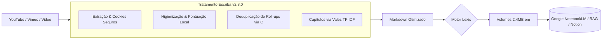

<p align="center">
  
</p>

<p align="center">
  
  
  
  
  
  
</p>

# Escriba: Video-to-Knowledge ETL Pipeline
### O Orquestrador de Inteligência para YouTube, Vimeo e Ingestão em RAG / NotebookLM

**Escriba** é um pipeline de extração, tratamento sintático-semântico e estruturação de dados não estruturados de vídeo para bases de conhecimento (**Google NotebookLM**, bancos vetoriais RAG e **Notion**).

Diferente de simples baixadores de legenda, o **Escriba v2.8.0** atua como um **Escriba Digital de Nível Editorial**: ele higieniza o texto bruto de voz (ASR), restaura a pontuação gramatical e maiúsculas localmente, deduplica *roll-ups* e segmenta os temas em capítulos lógicos, entregando documentos Markdown de altíssima fidelidade com máxima eficiência computacional.

O output final é uma base de conhecimento hiper-estruturada, pronta para:
* Alimentar assistentes de IA generativa (como o **Google NotebookLM**) sem alucinações por falta de pontuação ou vazamento de contexto.
* Integrar arquiteturas **RAG (Retrieval-Augmented Generation)** locais ou em nuvem com alta revocação (*recall*).
* Reduzir em mais de 98% o tempo gasto com curadoria manual de vídeos.

---

## 💎 Por que a Qualidade de Texto do Escriba faz Diferença para o NotebookLM?

Legendas automáticas do YouTube vêm como um "fluxo contínuo sem pontos, vírgulas ou maiúsculas", poluído por notas musicais (`♪`) e ruídos de áudio (`[Música]`). Enviar esse texto bruto para o NotebookLM faz com que a IA misture conceitos, corte citações ao meio e perca precisão.

O **Escriba** resolve esse problema através de um tratamento multicamadas:

```
[Legenda Bruta ASR] ➔ [1. Limpeza de Artefatos & Roll-ups] ➔ [2. Pontuação Acústica & Sintática] ➔ [3. Segmentação Semântica TF-IDF] ➔ [4. Encapsulamento <article> & Lexis] ➔ [Google NotebookLM]
```

### 🏆 Pilares de Qualidade no Tratamento do Texto

1. **✍️ Restauração Local de Pontuação & Maiúsculas**:
   - Analisa o tempo exato das pausas de fala do orador no SRT:
     - Pausas $\ge 0.4\text{s}$ ou fim de parágrafo $\rightarrow$ Inserção de **Ponto Final (`.`)** e **Maiúscula** na frase seguinte.
     - Pausas médias ($0.15\text{s}$ a $0.39\text{s}$) $\rightarrow$ Inserção de **Vírgula (`,`)**.
     - Frases com gatilhos interrogativos (*"por que"*, *"como"*, *"onde"*, *"será que"*) $\rightarrow$ Fechamento com **Ponto de Interrogação (`?`)**.
   - **100% Local**: Funciona na máquina sem depender de chamadas pagas a LLMs remotos ou latência de rede.

2. **📌 Garantia de Divisão por Capítulos (`##` e `###`)**:
   - Detecta os vales de similaridade de cosseno (TF-IDF) no vocabulário do orador.
   - Garante que todo vídeo possua uma estrutura hierárquica clara (`# Título` $\rightarrow$ `## Sumário` $\rightarrow$ `## Transcrição por Capítulos` $\rightarrow$ `### [timestamp] Tópico`), dividindo o vídeo em pelo menos 3 a 8 capítulos semânticos.

3. **📦 Consolidação de Volumes para NotebookLM (Motor Lexis)**:
   - Respeita o limite ideal de **2.4MB por volume (~500k tokens)** otimizado para a janela de contexto do Google NotebookLM.
   - Encapsula cada vídeo em escopos isolados `<article class="video-entry">` com **Frontmatter YAML** (`title`, `video_id`, `url`, `date`, `file_source`).
   - Gera uma **Tabela de Índice (Volume Index)** cronológica no rodapé do arquivo para navegação instantânea.

4. **🧹 Higienização de Ruídos e Termos Específicos (`rules.txt`)**:
   - Remove automaticamente notas musicais (`♪`), ruídos de ASR (`[Música]`, `[Aplausos]`, `[Vinheta]`) e vicios de fala (*"né"*, *"tipo"*, *"sabe"*).
   - Aplica substituições terminológicas customizadas (ex: *Ekklezia*, *Sete Montes*, *Shabbat*).

---

## ⚡ Performance & Otimizações de Baixo Nível (Bolt Engine)

As versões mais recentes do Escriba incorporam uma série de otimizações de baixo nível (*Bolt Engine*) com foco em processamento veloz de grandes volumes de legendas e diretórios massivos:

* **⚡ Iteração Nativa em C com Tuplas (`startswith`)**:
  - A checagem de prefixos de perguntas no motor gramatical (`rules.py`) foi refatorada para utilizar tuplas nativas com `str.startswith((...))`, substituindo geradores Python com `any()`.
  - **Impacto**: Redução de ~3x na sobrecarga de correspondência de sentenças, aproveitando a iteração direta em C.
* **📂 Varredura Rápida de Diretórios (`os.scandir`)**:
  - Substituição de chamadas `os.listdir()` + `os.path.getsize()` / `stat()` pelo iterador `os.scandir()` em `lexis.py` e utilitários de busca.
  - **Impacto**: O `os.scandir` consulta diretamente a tabela de diretórios do sistema operacional, eliminando centenas de chamadas de sistema `stat()` redundantes durante a consolidação.
* **⚡ Deduplicação de Linhas em C (`zip()`)**:
  - No algoritmo de remoção de *roll-ups* de legendas (`_dedup_lines`), comparações de sequências foram migradas para `zip()`, eliminando loops manuais indexados (`range(len)` / `enumerate`).
  - **Impacto**: Execução direta em nível de C, acelerando o processamento de legendas extensas de vídeos longos.
* **✂️ Fatiamento Nativo de Strings vs. Regex Pesado**:
  - Extração de cabeçalhos WEBVTT e delimitação de blocos YAML migrados de regexes com flags multiline (`re.DOTALL`) para busca posicional com `str.find()` e fatiamento direto em memória.
  - **Impacto**: Redução drástica de tempo de CPU e consumo de memória em caminhos críticos (*hot paths*).
* **🛡️ Padrão EAFP para Filesystem**:
  - Eliminação de verificações duplas no disco (padrão `if exists() -> stat()`). Adoção de blocos estruturados `try...except OSError` diretos sobre `stat()`, reduzindo acessos a disco pela metade.
* **🚀 Pré-Compilação Global de Expressões Regulares**:
  - Todas as expressões regulares de higienização e pontuação são pré-compiladas no escopo global dos módulos (`re.compile`), evitando compilações repetidas a cada frase analisada.

---

## 🛡️ Qualidade de Código & Engenharia de Software

O codebase passou por revisões profundas de arquitetura, robustez e boas práticas:

* **🧱 Arquitetura Modular & Desacoplada**:
  - Separação clara de responsabilidades entre módulos especializados: `escriba.py` (orquestração), `lexis.py` (consolidação NotebookLM), `rules.py` (regras e pontuação), `youtube.py` (integração YouTube), `vimeo.py` (integração Vimeo), `history.py` (estado atômico JSON) e `utils.py` (CLI & helpers).
* **🎯 Tipagem Estática Completa (Python Moderno / PEP 484 & 585)**:
  - Todas as assinaturas de funções e classes possuem anotações de tipo estritas com genéricos nativos (`list[str]`, `dict[str, Any]`, `Path`) e Enums explícitos (como `DownloadResult`).
* **🔒 Segurança e Privacidade de Cookies (`0o600`)**:
  - Função `filter_youtube_cookies` aprimorada: mantém **estritamente** os cookies dos domínios `.google.com` e `.youtube.com`, destruindo quaisquer credenciais de outros sites extraídas pelo navegador e aplicando permissões restritivas de arquivo (`chmod 0o600`).
* **🛠️ Tratamento Granular de Exceções & Auto-Healing**:
  - Substituição de blocos genéricos `except Exception:` por exceções granulares (`OSError`, `IOError`, `KeyError`).
  - Tratamento resiliente a limites de requisição (**HTTP 429**), detecção inteligente de terminal interativo vs não-interativo e captura graciosa de sinais de interrupção (`KeyboardInterrupt`).
* **🧪 Cobertura Abrangente de Testes**:
  - Suíte de testes com `pytest` utilizando isolamento via `tmp_path`, validação de migração de banco de dados (`history.py`), regras gramaticais (`rules.py`), descoberta de diretórios (`convert_all_bases.py`) e consolidação de volumes (`lexis.py`).

---

## ⏳ Economia de Tempo & ROI (Retorno sobre Investimento)

Mapear e catalogar conteúdo de vídeo manualmente é um gargalo operacional. O Escriba automatiza mais de 98% desse processo.

### Fluxo de Trabalho Manual vs. Pipeline Escriba (por Hora de Vídeo)

| Etapa do Processo | Tempo Manual Estimado | Tempo com Escriba | Descrição da Automação |
| :--- | :--- | :--- | :--- |
| **1. Extração/Download** | 10 a 15 min | **< 30 seg** | Download em lote de metadados e legendas de canais usando `yt-dlp`. |
| **2. Higienização & Pontuação** | 60 a 120 min | **Instantâneo** | Remoção de ruídos ASR (`♪`), restauração de `.`, `,`, `?` e maiúsculas via pausas acústicas. |
| **3. Quebra Semântica (Capítulos)**| 30 a 45 min | **< 10 seg** | Análise matemática do texto (TF-IDF + Vales de Cosseno) para garantir capítulos H2/H3. |
| **4. Estruturação Markdown** | 15 min | **Instantâneo** | Geração de metadados YAML, timestamps `[HH:MM:SS]` e encadeamento hierárquico. |
| **5. Consolidação de Volumes** | 10 min | **Instantâneo** | Agrupamento em volumes de 2.4MB com tags `<article>` e tabela de índice para o NotebookLM. |
| **TOTAL** | **~2 a 3.5 horas** | **~1 a 2 minutos** | **Ganho de produtividade superior a 98% por vídeo.** |

---

## ⚡ Funcionalidades de Elite

*   **⚡️ Mapeamento JSON Híbrido**: Leitura ultrarrápida de conteúdo via YouTube/Vimeo com fallback inteligente e unificação de metadados por pasta.
*   **🛠️ Auto-Healing de Autenticação**: Detecta cookies inválidos, regenera o cache e continua o download sem interrupções.
*   **✍️ Punctuation & Syntax Restoration**: Restauração local e automática de pontuação gramatical e maiúsculas baseada nas pausas da fala.
*   **🧠 Motor de NLP com Vales de Cosseno**: Garantia de divisão em capítulos baseada no vocabulário do orador, evitando documentos monolíticos.
*   **📚 Consolidação Lexis v2.8.0**: Encapsulamento em `<article>` com Frontmatter YAML e limite otimizado de 2.4MB por volume.
*   **📁 Repositório Único Inteligente**: Banco de dados JSON amarrado ao nome da pasta (`escriba_[folder_name].json`), com migração e consolidação automática.
*   **🎙️ Fallback de Áudio**: Extração automática de áudio bruto (`.mp3`/`.m4a`) caso o vídeo não possua legendas.

---

## 🏗️ Arquitetura do Sistema


```mermaid
graph LR
    A[YouTube / Vimeo / Video] --> B{Pipeline Escriba}
    subgraph B [Tratamento Escriba v2.8.0]
        B1[Extração & Cookies Seguros]
        B2[Higienização & Pontuação Local]
        B3[Deduplicação de Roll-ups via C]
        B4[Capítulos via Vales TF-IDF]
    end
    B --> C[Markdown Otimizado]
    C --> D{Motor Lexis}
    D --> E[Volumes 2.4MB em <article>]
    E --> F[(Google NotebookLM / RAG / Notion)]
```

### 🧱 Modularidade (Developer-Friendly)

*   `escriba.py`: Orquestrador principal do pipeline, download e gerador de Markdown.
*   `lexis.py`: Motor de consolidação em volumes de 2.4MB para NotebookLM com tags `<article>` e índices.
*   `rules.py`: Motor de pontuação acústica, limpeza de artefatos ASR (`♪`, `[Música]`) e substituição de termos.
*   `youtube.py`: Abstração de rede e orquestração do `yt-dlp` para YouTube.
*   `vimeo.py`: Módulo especializado para extração e mapeamento de canais Vimeo.
*   `history.py`: Gestão de estado atômico e persistência JSON.
*   `utils.py`: Sistema de design CLI e utilitários auxiliares.
*   `convert_all_bases.py`: Utilitário de migração e conversão massiva de diretórios e bases históricas.

---

## 🚀 Instalação

O Escriba é otimizado para **macOS**, **Linux**, **Windows** e **Docker**.

### Opção 1: Via Docker (Recomendado)

```bash
# 1. Build da Imagem
docker build -t escriba .

# 2. Execução (Monte o volume para preservar os arquivos)
docker run --rm -v "$(pwd):/app" escriba @CanalExemplo
```

### Opção 2: Configuração Local

```bash
# 1. Clone e acesse o diretório
cd escriba

# 2. Prepare o ambiente virtual
python3 -m venv .venv
./.venv/bin/python3 -m pip install -r requirements.txt

# 3. Use o script diretamente
python3 escriba.py @CanalExemplo
```

### 🧪 Testes Automatizados
Para rodar a suíte de testes com `pytest`:
```bash
pytest tests/
```

---

## 🖋️ Customização de Termos (`rules.txt`)

Você pode personalizar como palavras específicas são corrigidas criando um arquivo `rules.txt`:
* **Global**: `escriba/rules.txt`
* **Local**: `./rules.txt` (regras específicas do projeto atual).

```text
# Termo Original, Termo Corrigido
Eclesia = Ekklezia
Sete Montanhas, Sete Montes
Shabat, Shabbat
```

---

## 🛠️ Como Operar

```bash
# Processar canal (Mapeia, higieniza, pontua e gera Markdown)
escriba @CanalExemplo

# Consolidação NotebookLM: Gera volumes de 2.4MB formatados para a IA
escriba @CanalExemplo --consolidar

# Recriar volumes do zero (aplica as novas regras de pontuação e capítulos)
escriba @CanalExemplo --consolidar --lexis-reset

# Modo Offline: Regenerar todos os .md a partir do cache local de .srt
escriba --regen-md

# Conversão massiva de todas as bases locais
python convert_all_bases.py
```

---

## 🏛️ Licença
[MIT](LICENSE) © 2026 Ekklezia.
