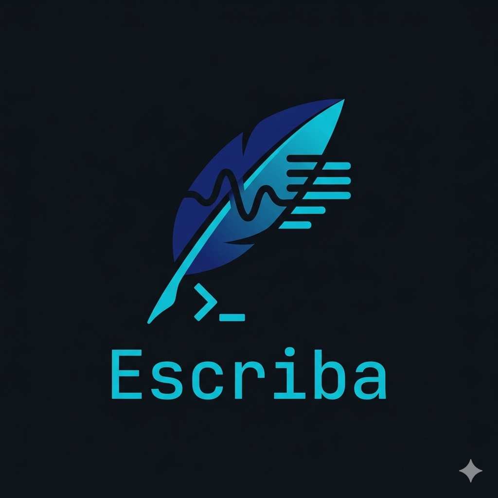
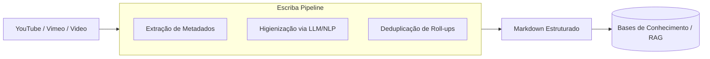
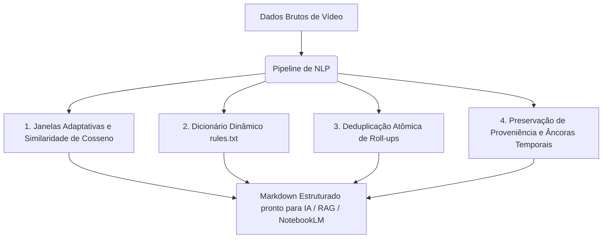

<p align="center">
  
</p>

<p align="center">
  
  
  
  
  
</p>

# Escriba: Video-to-Knowledge ETL Pipeline
### O Orquestrador de Inteligência para YouTube e Vimeo

**Escriba** é um pipeline de extração, higienização via LLM e estruturação de dados não estruturados de vídeo para bases de conhecimento (RAG/NotebookLM).

Diferente de simples scripts de download, o Escriba atua como um **Escriba Digital**: ele não apenas "baixa" o conteúdo, ele o interpreta, deduplica roll-ups de legendas automáticas e segmenta semanticamente os tópicos para criar documentos `.md` de altíssima fidelidade.

Ativos de vídeo corporativo (como treinamentos, conferências e reuniões) frequentemente se tornam "dados mortos" devido à dificuldade de busca e consulta. O Escriba resolve este gargalo de negócios ao automatizar a extração de transcrições, aplicar processos de higienização semântica e gerar documentos Markdown hierarquizados.

O output final é uma base de conhecimento limpa e otimizada, pronta para:
* Alimentar ferramentas de IA generativa e assistentes virtuais (como o Google NotebookLM).
* Integrar arquiteturas RAG (Retrieval-Augmented Generation) locais ou em nuvem.
* Reduzir drasticamente os custos e o tempo operacional gastos com curadoria manual de conteúdo.

---

## 💎 Por que usar o Escriba?

*   **Estudo Sem Interrupções**: O Escriba cuida de toda a parte chata e técnica (como bloqueios e erros de login) para que você foque apenas no aprendizado.
*   **Economia de Tempo Real**: Ele mapeia canais inteiros em minutos e baixa apenas o que é novo, garantindo que sua biblioteca esteja sempre atualizada sem esforço.
*   **Conteúdo Pronto para Estudar**: Esqueça textos bagunçados. Você recebe documentos organizados por assunto, fáceis de ler e perfeitos para usar em ferramentas como o NotebookLM.
*   **Biblioteca de Conhecimento Offline**: Uma ferramenta essencial para pesquisadores e estudantes que precisam organizar grandes volumes de informação e ter tudo acessível para consulta rápida, mesmo sem internet.
*   **Fidelidade Semântica e Rastreabilidade**: Cada bloco de texto gerado possui âncoras temporais (timestamps) apontando diretamente para o trecho exato no vídeo original, permitindo validação rápida (fact-checking).

---

## ⏳ Economia de Tempo & ROI (Retorno sobre Investimento)

Mapear e catalogar conteúdo de vídeo manualmente é um gargalo operacional. O Escriba automatiza mais de 98% desse processo, convertendo dados brutos em conhecimento estruturado em segundos.

### Fluxo de Trabalho Manual vs. Pipeline Escriba (por Hora de Vídeo)

| Etapa do Processo | Tempo Manual Estimado | Tempo com Escriba | Descrição da Automação |
| :--- | :--- | :--- | :--- |
| **1. Extração/Download** | 10 a 15 min | **< 30 seg** | Download em lote de metadados e legendas de canais ou vídeos usando `yt-dlp`. |
| **2. Higienização de Texto** | 60 a 120 min | **Instantâneo** | Limpeza automática de ruídos verbais (*"né"*, *"tipo"*), correção ortográfica via `rules.txt` e deduplicação de roll-ups. |
| **3. Quebra Semântica (Tópicos)**| 30 a 45 min | **< 10 seg** | Análise matemática do texto (TF-IDF + Similaridade de Cosseno) para detectar quebras de assunto reais e inserir timestamps. |
| **4. Estruturação e Formatação** | 15 min | **Instantâneo** | Geração de cabeçalhos Markdown, tags YAML e organização dos arquivos na pasta de destino. |
| **5. Consolidação de Volumes** | 10 min | **Instantâneo** | Agrupamento cronológico (Lexis) e geração de índices integrados para NotebookLM. |
| **TOTAL** | **~2 a 3.5 horas** | **~1 a 2 minutos** | **Ganho de produtividade superior a 98% por vídeo.** |

> [!TIP]
> Para um canal médio com 50 vídeos de 1 hora, o Escriba economiza entre **100 e 175 horas de trabalho qualificado**, eliminando tarefas repetitivas e liberando a equipe para focar na análise e aplicação do conhecimento.

---

## ⚡ Funcionalidades de Elite

*   **⚡️ Mapeamento JSON Híbrido**: Leitura ultrarrápida de conteúdo via YouTube-DLP (YouTube/Vimeo) com fallback inteligente e unificação de metadados por pasta.
*   **🛠️ Auto-Healing de Autenticação**: Detecta cookies inválidos, regenera o cache e continua o download sem interrupções.
*   **🧠 Motor de NLP Avançado**: Pipeline de 6 fases para limpeza de ruído, deduplicação de "muletas" orais e ancoragem temporal.
*   **📁 Repositório Único Inteligente**: Banco de dados JSON amarrado ao nome da pasta (`escriba_[folder_name].json`), com migração e consolidação automática de bases legadas.
*   **🎙️ Fallback de Áudio**: Se o vídeo não possui legendas, o Escriba extrai o áudio bruto (`.mp3`/`.m4a`) para processamento externo (ex: transcrição local/nuvem).
*   **📚 Consolidação Inteligente (Lexis)**: Agrupamento automático em volumes de ~1.8MB com índices cronológicos e metadados enriquecidos para otimizar o limite de arquivos do NotebookLM.

---

## 🏗️ Arquitetura do Sistema

O fluxo de processamento do Escriba transforma conteúdo audiovisual bruto em documentos semânticos estruturados:


```mermaid
graph LR
    A[YouTube / Vimeo / Video] --> B{Processamento}
    subgraph B [Escriba Pipeline]
        B1[Extração de Metadados]
        B2[Higienização via LLM/NLP]
        B3[Deduplicação de Roll-ups]
    end
    B --> C[Markdown Estruturado]
    C --> D[(Bases de Conhecimento / RAG)]
```

### 🧱 Modularidade (Developer-Friendly)
O núcleo foi refatorado para seguir padrões rigorosos de qualidade Python (PEP 8):
*   `youtube.py`: Abstração de rede e orquestração do `yt-dlp` para YouTube.
*   `vimeo.py`: Módulo especializado para extração e mapeamento de canais Vimeo.
*   `history.py`: Gestão de estado atômico e persistência JSON.
*   `rules.py`: Motor de limpeza léxica e processamento de regras.
*   `utils.py`: Sistema de design CLI e utilitários auxiliares.
*   `lexis.py`: Motor nativo de consolidação em volumes massivos; realiza enriquecimento de metadados e gera índices estruturados para o NotebookLM.

---

## 🚀 Instalação

O Escriba é otimizado para **macOS**, mas roda perfeitamente em Linux, Windows e **Docker**.

### Opção 1: Via Docker (Recomendado)
A maneira mais rápida de rodar o Escriba com todas as dependências isoladas.

```bash
# 1. Build da Imagem
docker build -t escriba .

# 2. Execução (Monte o volume para preservar o cache e os arquivos)
docker run --rm -v "$(pwd):/app" escriba @CanalExemplo
```

### Opção 2: Configuração Local (Unix/macOS)

```bash
# 1. Clone e acesse o diretório
cd escriba

# 2. Prepare o ambiente (Criação única)
python3 -m venv .venv
./.venv/bin/python3 -m pip install -r requirements.txt

# 3. Use o script diretamente
python3 escriba.py @Canal
```

> [!TIP]
> **Auto-Venv**: O script possui lógica interna para se re-executar no ambiente virtual local se detectado!

### 🧪 Testes Unitários
Para garantir a integridade das regras de limpeza e do banco de dados:
```bash
# Executa todos os testes unitários
./.venv/bin/pytest tests/
```

---

## 🖋️ Customização de Termos (rules.txt)

O Escriba possui um motor de limpeza de termos dinâmico. Você pode personalizar como palavras específicas são tratadas criando um arquivo `rules.txt`:

1.  **Global**: `/Users/jandirp/scripts/escriba/rules.txt`
2.  **Local**: `./rules.txt` (regras específicas para a pasta/projeto atual).

**Formato do arquivo:**
```text
Termo Original, Termo Corrigido
PalavraAntiga = PalavraNova
Shabat, Shabbat
Ceu, Céu
```

---

## 🛠️ Como Operar

O Escriba aceita Handles (`@Canal`), URLs completas (YouTube/Vimeo) ou IDs de vídeos únicos.

```bash
# Sincronização Incremental (Padrão: mapeia canal, extrai subs e gera MD)
escriba @FilipeDeschamps

# Suporte a Vimeo (Canais e Vídeos)
escriba https://vimeo.com/user136027363

# Modo Áudio: Baixa MP3 de um vídeo específico
escriba -a https://youtu.be/dQw4w9WgXcQ

# Histórico Retroativo: Baixar apenas vídeos a partir de uma data
escriba -d 20260101 @CanalExemplo

# Manutenção: Regenerar todos os arquivos .md a partir do cache local
escriba --regen-md

# Consolidação NotebookLM: Gera volumes baseados nos arquivos do canal
escriba @CanalExemplo --consolidar
```

### Flags de Poder

| Opção | Propósito |
|---|---|
| `-l, --lang` | Força o idioma das legendas (ex: `pt`, `en`). |
| `-a, --mp3` | Baixa apenas o áudio convertido em MP3. |
| `-d, --date` | Data limite (YYYYMMDD). Baixa apenas vídeos posteriores a esta data. |
| `-rc, --refresh-cookies` | Purga o cache de cookies e extrai novos do Chrome. |
| `-f, --fast` | **Modo Turbo**: Remove o delay entre requisições de metadados. |
| `--no-md` | Pula a segmentação semântica e preserva apenas o arquivo bruto. |
| `--keep-srt` | Mantém o arquivo `.srt` no disco após converter para `.md`. |
| `--regen-md` | **Modo Offline**: Gera/Regenera todos os `.md` a partir dos `.srt` locais. |
| `--force` | (Usado com `--regen-md`) Sobrescreve arquivos existentes e força re-processamento. |
| `--upgrade-md` | Converte cabeçalhos de `.md` antigos para o formato YAML + H1. |
| `--consolidar` | Gera volumes unificados (Lexis) otimizados para o NotebookLM. |
| `--lexis-reset` | Apaga os volumes consolidados existentes e reconstrói do zero. |
| `--migrate` | Migra bancos de dados JSON legados para a estrutura multi-canal atual. |
| `--ignore-metadata` | Pula a recuperação de metadados faltantes no histórico. |
| `-v, --version` | Exibe a versão atual do sistema. |

---

## 🧬 Escriba Scientific: O Motor de NLP & Qualidade de Dados

O Escriba implementa um pipeline proprietário de **Engenharia de Tópicos** para garantir que a transcrição seja legível por humanos, altamente contextualizada para sistemas RAG e livre de ruídos de dados públicos brutos.


```mermaid
graph TD
    A[Dados Brutos de Vídeo] --> B(Pipeline de NLP)
    B --> C[1. Janelas Adaptativas e Similaridade de Cosseno]
    B --> D[2. Dicionário Dinâmico rules.txt]
    B --> E[3. Deduplicação Atômica de Roll-ups]
    B --> F[4. Preservação de Proveniência e Âncoras Temporais]
    C --> G[Markdown Estruturado pronto para IA / RAG / NotebookLM]
    D --> G
    E --> G
    F --> G
```

### O Pipeline de Processamento de Alta Qualidade:

1.  **Janelas Adaptativas & Similaridade de Cosseno**: O tamanho da análise varia conforme a duração do vídeo. O algoritmo detecta vales de similaridade (via TF-IDF + similaridade de cosseno) para identificar quebras de assunto naturais. Isso garante que a quebra de tópicos em Markdown ocorra onde a discussão realmente mudou de direção, em vez de cortes por tempo ou palavras fixas.
2.  **Dicionário Dinâmico de Termos (`rules.txt`)**: Corrige falhas fonéticas comuns de legendagem em tempo real sobre nomes próprios, siglas e termos técnicos. Permite substituições customizadas no escopo local ou global do projeto.
3.  **Deduplicação de Roll-ups**: Remove automaticamente a duplicação persistente de texto comum em legendas sincronizadas, reduzindo desperdício de tokens nas IAs e melhorando consideravelmente a leitura humana.
4.  **Dicionário de Marcadores Orais**: Filtra ruídos recorrentes de fala informal como *"né"*, *"tipo"*, *"basically"*, *"sabe?"*, tornando a transcrição limpa.
5.  **Sanitização Estrutural**: Limpeza automática de tags e artefatos de arquivos HTML/SRT brutos.
6.  **Proveniência de Timestamps**: Mantém links com âncoras temporais ao longo do documento Markdown, permitindo auditorias rápidas (fact-checking) diretamente no vídeo original no YouTube ou Vimeo.

---

## 🏛️ Sobre o Escriba
Ferramenta desenvolvida para capacitar estudantes e profissionais a dominar grandes volumes de informação. O Escriba é o guardião da memória digital.

---

## Licença
[MIT](LICENSE) © 2026 Ekklezia.
